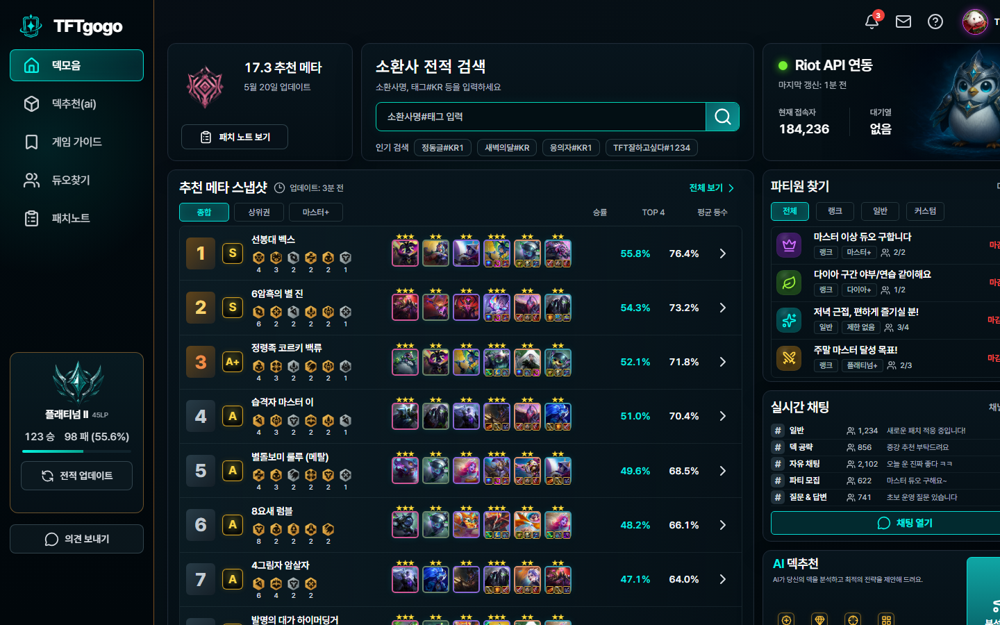
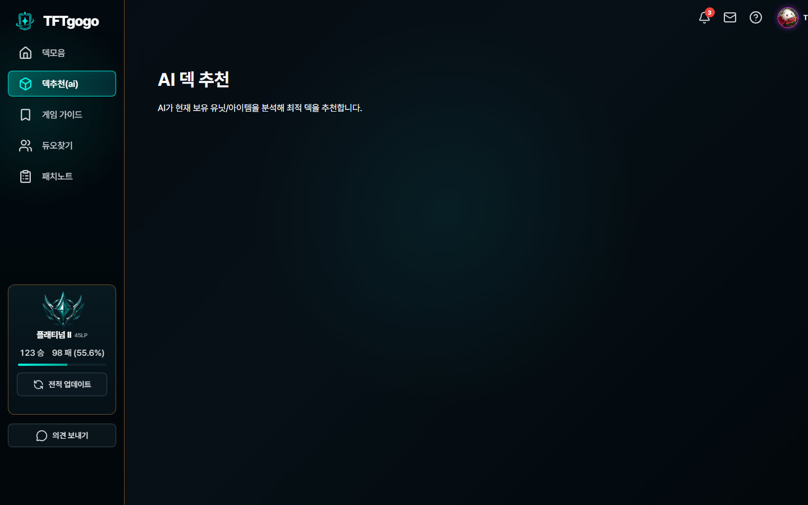
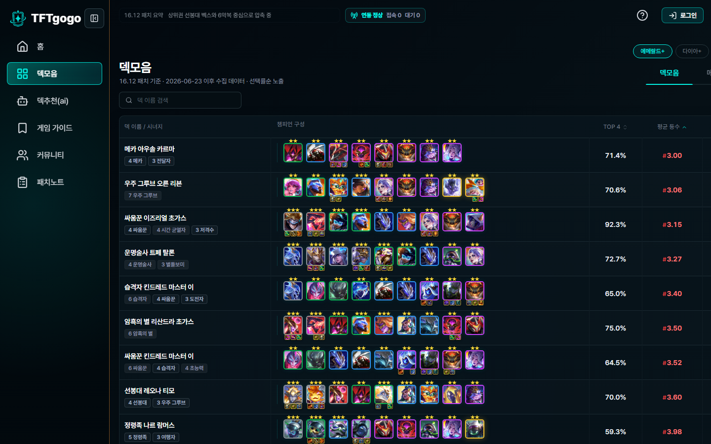
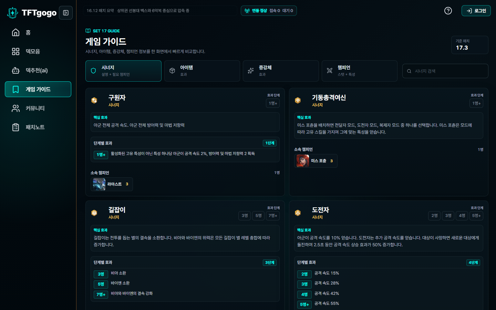
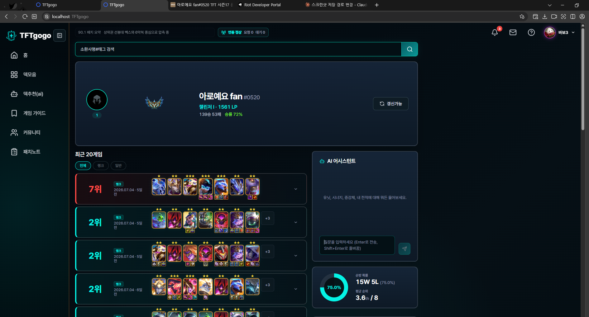
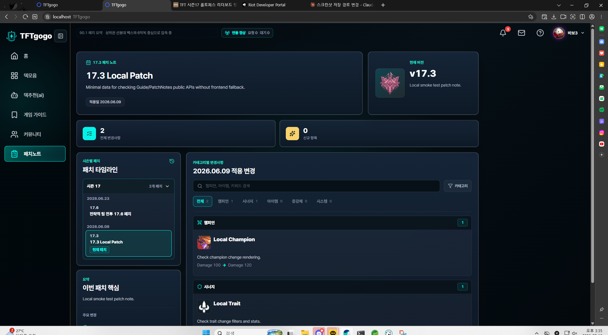
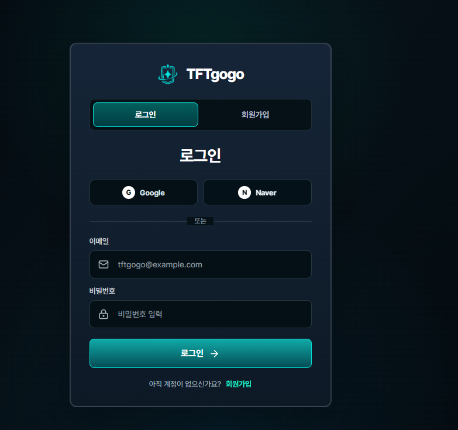
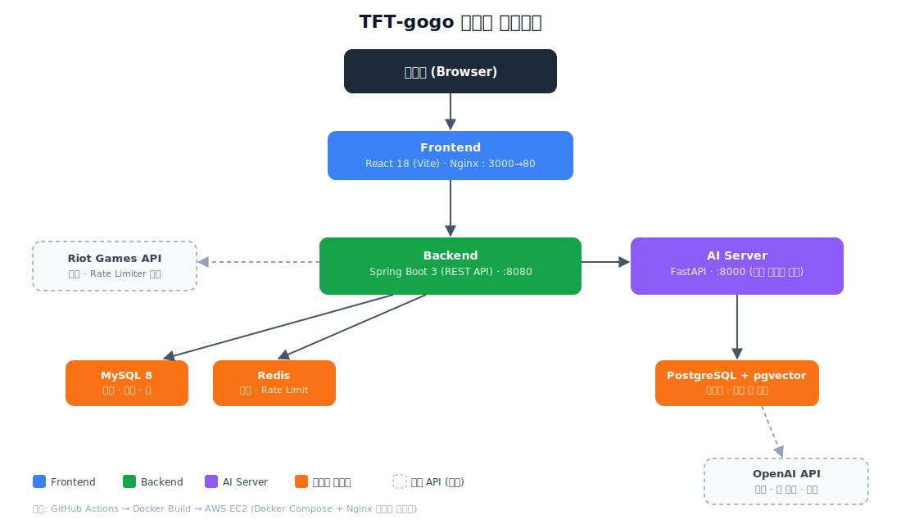

# TFT-gogo 🎮

> 롤토체스(TFT) 유저를 위한 전적 분석 · AI 메타 추천 · 커뮤니티 통합 플랫폼

<br>

## 소개

**TFT-gogo**는 롤토체스 유저가 자신의 전적을 분석하고, AI 기반 덱 추천을 받으며, 다른 유저와 전략을 공유할 수 있는 통합 서비스입니다.

<br>

## 주요 화면

> 📸 커뮤니티 · 파티 모집 화면은 스크린샷 준비 중입니다.

| 화면 | 설명 |
|------|------|
| 대시보드 |  |
| AI 추천 |  |
| 메타 덱 모음 |  |
| 게임 가이드 |  |
| 전적 검색 · 매치 상세 |  |
| 커뮤니티 · 파티 모집 | (추가 예정) |
| 패치노트 |  |
| 로그인 |  |

<br>

## 핵심 기능

### 🔍 전적 검색
소환사명 + 태그로 Riot API에서 프로필(레벨, 아이콘, 랭크 정보)을 조회하고, 최근 매치 기록을 수집합니다. 매치 상세에서는 배치 순위, 덱 구성, 시너지, 아이템 등을 확인할 수 있습니다. Riot API Rate Limiter와 매치 캐싱으로 호출 제한을 관리합니다.

### 🤖 AI 추천 · 채팅
소환사의 최근 랭크 전적과 현재 메타 덱 데이터를 조합하여 AI 서버로 전송하면, OpenAI API 기반으로 맞춤 덱을 추천합니다. 별도의 AI 채팅 기능에서는 TFT 전략 관련 질의응답이 가능하며, 사용자별 Rate Limit이 적용됩니다.

### 📊 메타 덱 · 영웅증강 덱
티어별(마스터+, 다이아+ 등) 메타 덱 순위를 스케줄러로 자동 수집하여 제공합니다. 각 덱의 챔피언 구성, 시너지, 핵심 아이템, 승률 등을 조회할 수 있습니다. 관리자가 영웅증강 기반 추천 덱을 직접 등록·관리하는 기능도 포함합니다.

### 📖 게임 가이드
Community Dragon(CDragon)에서 챔피언, 시너지, 아이템, 증강 데이터를 스케줄러로 자동 import합니다. 패치 버전별로 데이터가 관리되며, 키워드 검색과 DB 페이지네이션을 지원합니다.

### 📰 패치노트
공식 패치노트를 크롤링·파싱하여 변경사항을 카테고리(챔피언, 아이템, 시너지 등)와 영향도(buff, nerf, adjust)로 분류합니다. 패치별 필터링, 검색, 요약 하이라이트 기능을 제공합니다.

### 🎉 커뮤니티 · 파티 모집
게임 모드별 파티 모집글을 작성하고, 다른 유저가 신청·수락할 수 있습니다. 파티 채팅방에서 실시간 메시지 교환이 가능합니다.

### 🔐 회원 · 인증
Google, Kakao, Naver 소셜 로그인을 지원합니다. OAuth2 인증 후 JWT 토큰을 발급하여 API 인증에 사용합니다. 관리자 계정은 별도 JWT 기반 인증으로 분리되어 있습니다.

<br>

## 시스템 아키텍처



- **Frontend**(React, Nginx) → **Backend**(Spring Boot)로 API 요청
- **Backend**는 MySQL(영속 데이터)과 Redis(캐시 · Rate Limit)를 사용하고, Riot Games API를 외부 호출
- **Backend** ↔ **AI Server**(FastAPI)는 내부 시크릿 기반으로 통신하며, AI Server는 PostgreSQL(pgvector)과 OpenAI API를 사용
- 배포: GitHub Actions → Docker 이미지 빌드 → AWS EC2(Docker Compose + Nginx 리버스 프록시)

<br>

## 기술 스택 및 선정 이유

| 영역 | 기술 | 선정 이유 |
|------|------|-----------|
| **Backend** | Spring Boot 3 | 성숙한 생태계와 DDD 구조 적용 용이성 |
| | MySQL | 전적·회원·덱 등 관계형 데이터의 정합성 관리 |
| | Redis | Riot API 응답 캐싱(TTL)과 Rate Limiter 구현에 사용, 외부 API 호출 제한 대응 |
| | JWT / OAuth2 | Google·Kakao·Naver 소셜 로그인 후 무상태(stateless) 인증으로 서버 확장성 확보 |
| **AI Server** | FastAPI | Python 기반 AI/LLM 생태계와의 호환성, 비동기 처리로 OpenAI API 호출 대응 |
| | PostgreSQL + pgvector | 메타 덱 임베딩을 저장하고 벡터 유사도 검색으로 추천 품질을 높이기 위해 채택 |
| | OpenAI API | 자체 LLM 학습·운영 없이 검증된 모델을 프롬프트 엔지니어링으로 빠르게 적용 |
| **Frontend** | React 18 (Vite) | 빠른 HMR과 컴포넌트 기반 재사용성 |
| | Zustand | Redux 대비 보일러플레이트가 적은 경량 전역 상태 관리 |
| | TanStack Query | 서버 상태(캐싱·재검증·로딩/에러)를 선언적으로 관리해 불필요한 API 재호출 최소화 |
| **Infra** | AWS EC2, Nginx, Docker | 컨테이너 기반으로 환경 일관성을 확보하고, Nginx로 리버스 프록시·정적 파일을 서빙 |
| | GitHub Actions | 빌드·배포 파이프라인 자동화 |

<br>

## 실행 방법

### 사전 요구사항
- Docker, Docker Compose

### 로컬 실행 (Docker Compose)

```bash
git clone https://github.com/s4ngg/TFT-gogo.git
cd TFT-gogo
```

루트에 `.env` 파일을 생성합니다 (`docker-compose.yml` 참고). `JWT_SECRET`, `AI_SERVER_INTERNAL_SECRET` 등은 로컬 개발용 기본값이 이미 동작하므로 그대로 두어도 되지만, 전적 검색·매치 조회 기능을 실제로 확인하려면 발급받은 Riot API 키가 필요합니다.

```bash
RIOT_API_KEY=your-riot-api-key
```

**Riot API 키 발급 방법**

1. [Riot Developer Portal](https://developer.riotgames.com/)에 접속합니다.
2. 우측 상단에서 로그인합니다.
3. 로그인 후 같은 페이지에서 **REGENERATE API KEY** 버튼을 클릭해 키를 발급합니다.
4. 발급된 키를 복사해 `.env`의 `RIOT_API_KEY` 값에 붙여넣습니다.

> ⚠️ 이 키는 24시간마다 만료되는 개발용 키입니다. 만료 시 같은 방법으로 재발급 후 `.env`를 갱신하고 컨테이너를 재시작해야 합니다.

```bash
docker compose up -d --build
```

실행 후 접속:

| 서비스 | 주소 |
|--------|------|
| Frontend | http://localhost:3000 |
| Backend | http://localhost:8081 |
| Backend API 문서 (Swagger) | http://localhost:8081/swagger-ui/index.html |
| AI Server | 컨테이너 내부 전용 (Backend를 통해서만 접근) |

<br>

## 프로젝트 구조

```text
TFT-gogo/
├── backend/       # Spring Boot API 서버
├── ai-server/     # FastAPI AI 추천·채팅 서버
├── frontend/      # React 클라이언트
├── docs/          # 프로젝트 문서 (스펙, 컨벤션, QA 등)
├── docker-compose.yml
└── docker-compose.local-smoke.yml
```

<br>

## Backend 패키지 구조

도메인 주도 설계(DDD) 기반으로, 각 도메인이 동일한 패키지 구조를 따릅니다.

```text
backend/src/main/java/com/tftgogo/
├── domain/
│   ├── ai/
│   ├── community/
│   ├── deck/
│   ├── guide/
│   ├── match/
│   ├── member/
│   ├── patchnote/
│   └── search/
└── global/
```

### 도메인별 표준 패키지

| 패키지 | 역할 |
|--------|------|
| `controller/` | REST API 엔드포인트. `@RestController` 클래스가 위치하며 요청 라우팅과 응답 반환을 담당 |
| `controller/docs/` | Swagger 문서 인터페이스. 컨트롤러와 API 문서 어노테이션을 분리하여 가독성 확보 |
| `dto/request/` | 클라이언트 → 서버 요청 객체. API 파라미터 바인딩 및 커맨드 객체 |
| `dto/response/` | 서버 → 클라이언트 응답 객체. API 응답 데이터 구조 정의 |
| `entity/` | JPA 엔티티. DB 테이블과 1:1 매핑되는 도메인 모델 |
| `repository/` | Spring Data JPA 리포지토리 인터페이스. 데이터 접근 계층 |
| `service/` | 비즈니스 로직 인터페이스. 도메인 규칙과 유스케이스 정의 |
| `service/impl/` | 서비스 구현체. 인터페이스-구현 분리로 테스트 용이성 확보 |

### 도메인 전용 패키지 (선택)

| 패키지 | 역할 | 사용 도메인 |
|--------|------|-------------|
| `client/` | 외부 API 호출 클라이언트 | ai |
| `config/` | 도메인 전용 설정 (`@ConfigurationProperties`) | patchnote |
| `scheduler/` | 주기적 데이터 수집·동기화 스케줄러 | deck, guide, patchnote |
| `dto/crawl/` | 외부 크롤링 응답 매핑용 DTO | patchnote |

### global 패키지

| 패키지 | 역할 |
|--------|------|
| `config/` | CORS, Swagger, Security 등 애플리케이션 공통 설정 |
| `exception/` | `BusinessException`, `ErrorCode`, 전역 예외 핸들러 |
| `filter/` | JWT 인증, 관리자 토큰 등 서블릿 필터 |
| `response/` | 통합 API 응답 래퍼 (`ApiResponse`) |
| `riot/` | Riot Games API 클라이언트, Rate Limiter, TFT 에셋 유틸리티 |
| `security/` | JWT 토큰 발급·검증, OAuth2 소셜 로그인 핸들러 |
| `cdragon/` | Community Dragon 에셋 캐시 서비스 |

<br>

## Frontend 구조

```text
frontend/src/
├── api/           # API 호출 함수 (Axios 인스턴스, 도메인별 API 모듈)
├── components/    # 공통 UI 컴포넌트 (ChampionCard, TierBadge 등)
├── hooks/         # 공통 커스텀 훅 (데이터 페칭, 상태 관리)
├── pages/         # 페이지별 디렉터리 (하위에 components/, hooks/, utils/ 포함)
├── store/         # Zustand 전역 상태 관리
├── constants/     # 상수 정의 (티어, 채팅방 ID 등)
├── types/         # TypeScript 타입 정의
└── styles/        # CSS 변수, 테마 토큰
```

| 패키지 | 역할 |
|--------|------|
| `api/` | Axios 기반 API 호출 함수. 도메인별로 파일이 분리되며 공통 인스턴스와 응답 타입 공유 |
| `components/common/` | 여러 페이지에서 재사용되는 UI 컴포넌트 |
| `components/layout/` | 앱 레이아웃 (사이드바, 상단바, 관리자 레이아웃) |
| `hooks/` | TanStack Query 기반 데이터 페칭 훅과 상태 관리 훅 |
| `pages/{Page}/` | 페이지 단위 디렉터리. 해당 페이지 전용 컴포넌트·훅·유틸을 내부에 포함 |
| `store/` | Zustand 스토어. 검색 상태, 인증 상태, 레이아웃 상태 등 전역 상태 관리 |

<br>

## AI Server 구조

```text
ai-server/app/
├── api/           # FastAPI 라우터 (분석, 채팅 엔드포인트)
├── core/          # 환경 설정 (OpenAI API 키, DB 연결 등)
├── models/        # 요청·응답 데이터 모델 (Pydantic)
└── services/      # 비즈니스 로직 (전적 분석, 덱 추천, 채팅 처리)
```

| 패키지 | 역할 |
|--------|------|
| `api/` | FastAPI 라우터. 전적 분석(`/analyze`)과 채팅(`/chat`) 엔드포인트 정의 |
| `core/` | 환경 변수 로드 및 앱 설정 |
| `models/` | Pydantic 모델. 요청 검증과 응답 직렬화를 담당 |
| `services/` | 핵심 비즈니스 로직. OpenAI API 호출, 전적 데이터 분석, 메타 덱 기반 추천 생성 |

<br>

## 문서 구조

```text
docs/
├── for-ai/        # AI 코드리뷰용 컨벤션·스펙 문서
├── for-humans/    # 팀 공유용 기획서·체크리스트·릴리즈노트
├── qa/            # QA 체크리스트, DB 스키마 변경 규칙
├── screenshots/   # GitHub 이슈·PR용 스크린샷
└── team-share/    # AWS 인프라 가이드, 운영 런북
```

<br>

## 도메인별 담당자

| 도메인 | 담당자 |
|--------|--------|
| 🔍 전적 검색 (`search` · `match`) | 김성원 (gungang1212-tech) |
| 🤖 AI 추천 · 채팅 (`ai` · `ai-server`) | 김상우 (s4ngg) |
| 📊 메타 덱 · 영웅증강 덱 (`deck`) | 김상우 (s4ngg) |
| 📖 게임 가이드 (`guide`) | 이현재 (TIG-korea) |
| 📰 패치노트 (`patchnote`) | 이현재 (TIG-korea) |
| 🎉 커뮤니티 · 파티 모집 (`community`) | 이소정 (DevAgumon) |
| 🔐 회원 · 인증 (`member`) | 이소정 (DevAgumon) |
